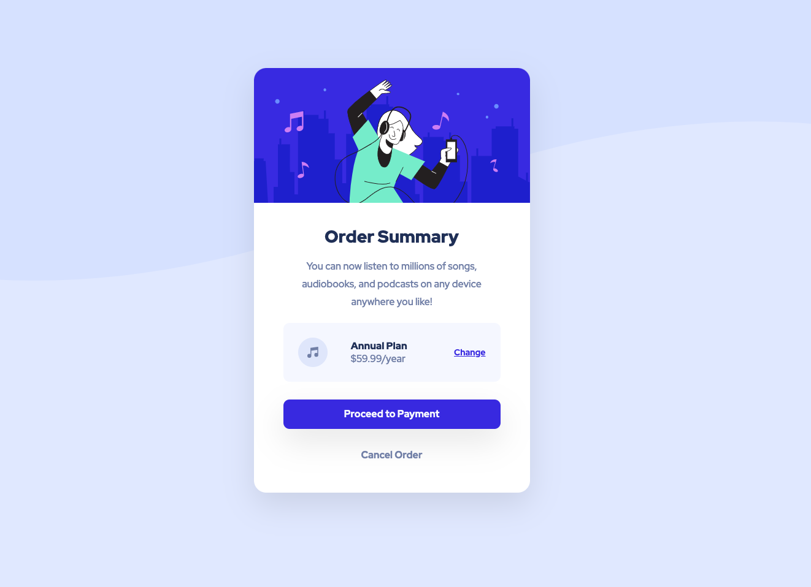

# Frontend Mentor - Order summary card solution

This is a solution to the [Order summary card challenge on Frontend Mentor](https://www.frontendmentor.io/challenges/order-summary-component-QlPmajDUj). Frontend Mentor challenges help you improve your coding skills by building realistic projects.

## Table of contents

- [Overview](#overview)
  - [The challenge](#the-challenge)
  - [Screenshot](#screenshot)
  - [Links](#links)
- [My process](#my-process)
  - [Built with](#built-with)
  - [What I learned](#what-i-learned)
  - [Continued development](#continued-development)
  - [Useful resources](#useful-resources)
- [Author](#author)

## Overview

### The challenge

Users should be able to:

- See hover states for interactive elements

### Screenshot

Mobile Design


Desktop Design


### Links

- Solution URL: [https://github.com/kennbach/order-summary-component](https://github.com/kennbach/order-summary-component)
- Live Site URL: [https://kennbach.github.io/order-summary-component/](https://kennbach.github.io/order-summary-component/)

## My process

### Built with

- Semantic HTML5 markup
- CSS Variables
- CSS Grid
- Mobile-first workflow
- Accessibility Aware

### What I learned

This project had a little bit of css grid layout, and I was able to tryout the `grid-template-areas` to format some of the component.

```css
.product-details {
  display: grid;
  grid-template-areas:
    "product-icon product-name product-edit"
    "product-icon product-price product-edit";
  ...;
}
```

### Continued development

I continue to focus on best practices and accessibility, trying to apply everything I gained from previous projects.

### Useful resources

- [The Net Ninja: HTML & CSS Crash Course](https://youtube.com/playlist?list=PL4cUxeGkcC9ivBf_eKCPIAYXWzLlPAm6G) - This is a great resource to learn or refresh your HTML and CSS knowledge from the ground up.

- [The Net Ninja: CSS Variables](https://youtube.com/playlist?list=PL4cUxeGkcC9ii5PB2UMyYH7QFZWfGnVgZ) - This is a great resource to learn CSS variables.

- [The Net Ninja: CSS Grid](https://youtube.com/playlist?list=PL4cUxeGkcC9itC4TxYMzFCfveyutyPOCY) - This is a great resource to learn CSS grid.

- [Kevin Powell: Are you using the right CSS units?](https://youtu.be/N5wpD9Ov_To) - There are a lot of different units that we can use when writing CSS, in this video Kevin gives some general rules of thumb of which ones are best suited for which situations. This is also where I learned how to convert the root font-size to base-10.

- Both, [Kevin Powell](https://www.youtube.com/kepowob) and [The Net Ninja](https://www.youtube.com/c/TheNetNinja) have a virtual-ton of great web app development tutorials. I only listed a few above, but there are many, many more.

## Author

- Github - [kennbach](https://github.com/kennbach)
- Frontend Mentor - [@kennbach](https://www.frontendmentor.io/profile/kennbach)
